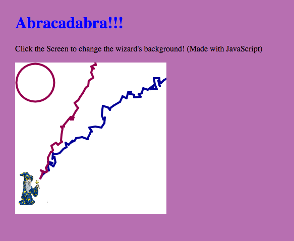
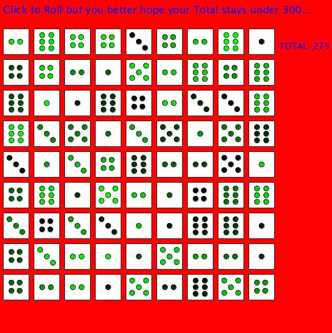
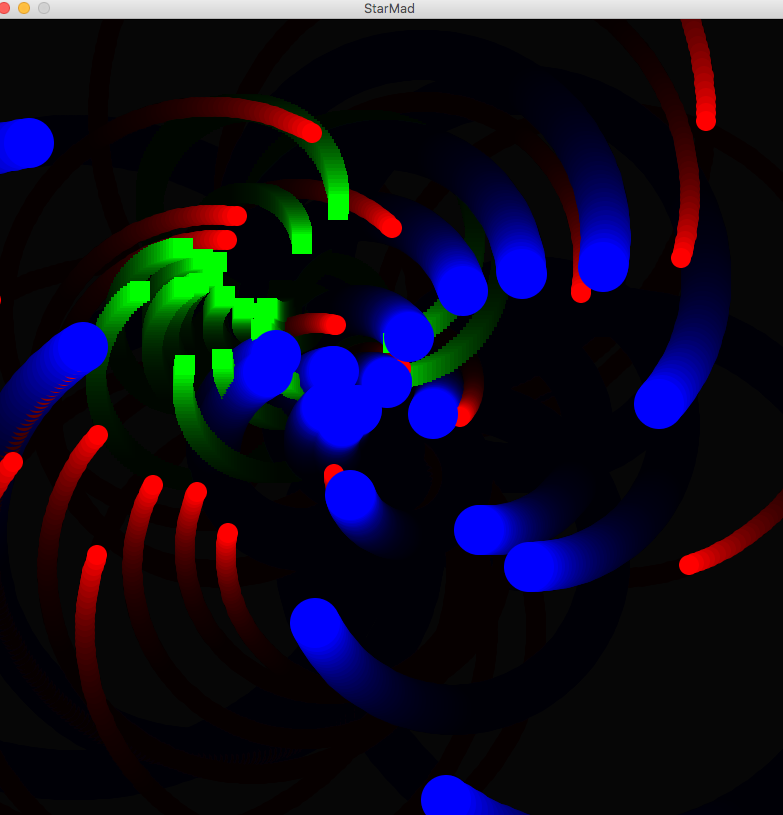

# Madison's csPortfolio :smile:
* MyWebPage [here](https://baileym13.github.io/webPage/dogPage/)
>This was the first project that heavily relied on HTML. The content is meant to be somewhat ironic, playing fun at the idea of artsy hipster people. My best feature is the page slowly turning blue. 
* Lightning JS
>This is my favorite project, aesthetically. It was a happy accident that the lightning all ended up going to one spot, so I saw this and thought of magic, which inspired the rest of the project. 


* Dice
>This relied on Math.random. I didn't love this project, but I did my best to make it fun with large images appearing on the screen. 

* College Presentation [here](https://docs.google.com/presentation/d/e/2PACX-1vTtRuDra-o5QG_VG1JsPcMCz6DuLpgKQ9KB-BCUCgpqbUZhDxl-JE89xSZNWhuGXtcXcQ5jGs4bzy_D/embed?start=true&loop=true&delayms=3000)
>College presentation on Carleton College.
* Starfield [here](https://baileym13.github.io/starfield5/)
>Project using inheritance. I used bright colors to be aesthetically pleasing. 
Inline-style: 


## Madison's Code Selection
```Java
void draw()
{
   background(backRed);
    
  stroke(0,0,(int)(Math.random()*255)+1);
  while(endX<=301)
  {
    endX=startX+(int)(Math.random()*18)-5;
    endY=startY +(int)(Math.random()*18)-12;
    line(startX,startY,endX,endY);
    startX=endX;
    startY=endY;
  }
   stroke((int)(Math.random()*255)+1,0,(int)(Math.random()*255)+1);
  while(endX2<=301)
  {
    endX2=startX2+(int)(Math.random()*15)-5;
    endY2=startY2 +(int)(Math.random()*15)-12;
    line(startX2,startY2,endX2,endY2);
    startX2=endX2;
    startY2=endY2;
  }
 startX=50;
startY=230;
endX=150;
endY=200;

 startX2=50;
startY2=230;
endX2=0;
endY2=200;
ellipse(40,40,75,75);
wiz.resize(60,70);
image(wiz,5,215);
}
```

## Computer Science Reflection
1. My projects tend to rely on creativity, to add the extra element that makes them interesting.
2. I really enjoy the artistic and themely aspects of my coding. I try to step above the assignment and make the project interesting. 
3. I am proud that i got my lighning in the lighning project to all go to the same place. That way it looks like magic. 
4. The hardest hurdle I went through was making the pumkins in chemotaxis change into jack o lanterns, I resolved it by seeking Dr. R's help and the classes as help. 
5. The code above shows the draw method of my wizard lightning project. Math.random is used to create the lighning effect so the bolt of light ends up in random locations but still in a line. The starting and ending locations are changed so it always starts and ends in the same place.
6. The first development process of the code above was to just accomplish lighning shooting across the screen for the above code. Once I accomplished that, I had to move the lightning to specific spots. I did that with starting and ending points. This development was very collaborative as i asked help of my peers many times with the orginal basic code of the project. Getting deeper within the project, I was independent and relied on guessing and checking and looking at API to solve problems. 
